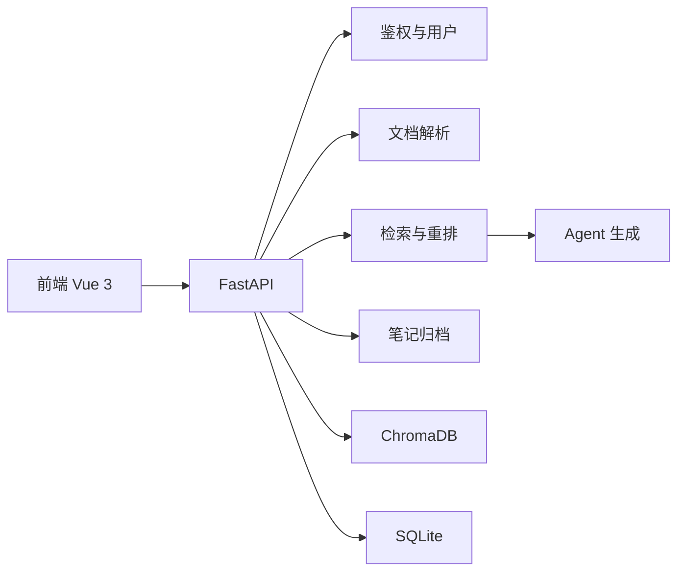
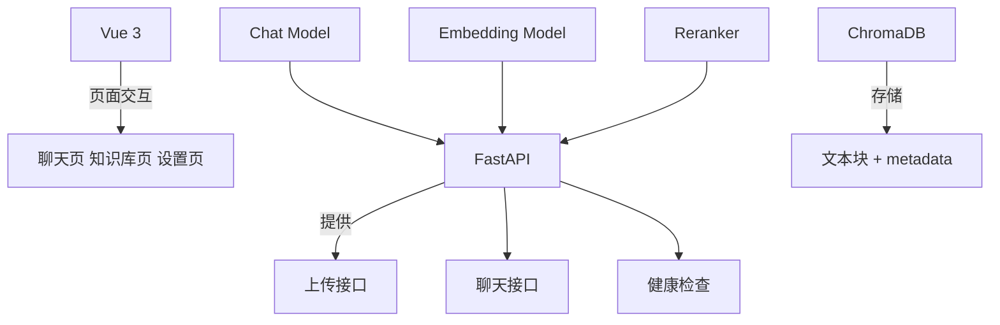
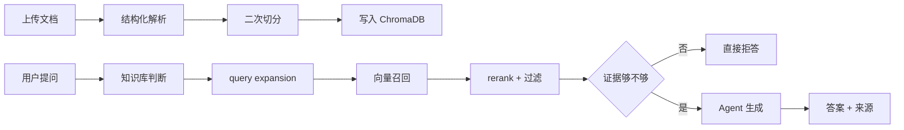
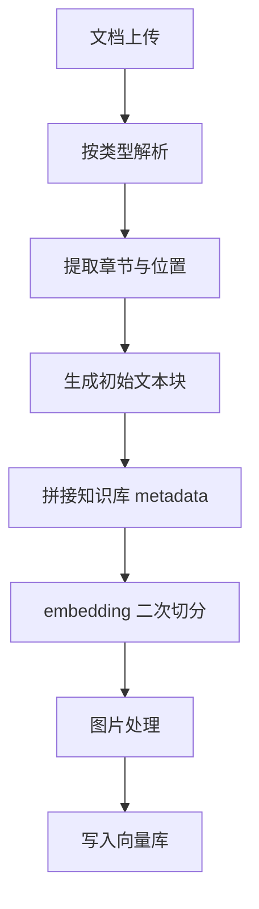
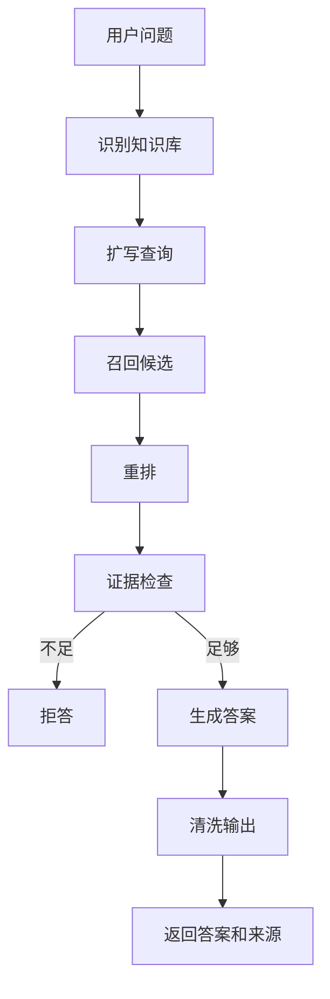

# 一次个人 RAG 探索的功能解析与实践总结

先说明一下背景：我本身只是前端开发者，这次更多是站在使用和实现结合的角度，去做一轮个人 RAG 探索。Agent 在这里主要承担了辅助搭建、整理链路和帮助落地实现的角色，并不是我已经完整掌握了整套 Agent 体系。

这篇内容也只从当前这次探索出发，只看已经落地的功能、背后的实现思路，以及后续还能怎么继续打磨。很多理解仍然比较朴素，更接近一次阶段性记录。

## 整体结构

## 一、技术选型

这次探索采用的是前端、后端、存储分层的方式：

- Vue 3 负责聊天、知识库、设置、登录和笔记等交互界面
- FastAPI 负责鉴权、文档解析、向量入库、检索、重排、笔记任务和流式输出
- ChromaDB 负责本地向量持久化与检索承载
- SQLite 负责业务数据，包括用户、知识库空间和笔记

我最后保留这套组合，主要是因为它足够直接：

- Vue 3 适合处理聊天流、知识库列表、任务轮询和设置页这些状态型界面
- FastAPI 同时能覆盖 JSON API、文件上传、后台任务和 SSE
- ChromaDB 适合本地持久化，验证完整链路成本低
- Chat、Embedding、Reranker 解耦后，方便分别替换和调试
- Web 形态更适合直接联调、部署和验证完整问答链路

### 技术选型关系图

### 选择重点

| 部分     | 为什么这样选                                           |
| -------- | ------------------------------------------------------ |
| Vue 3    | 状态多，适合组合式组织                                 |
| FastAPI  | 上传、流式、鉴权、后台任务都能一起处理                 |
| ChromaDB | 本地优先，验证成本低                                   |
| SQLite   | 用户、知识库空间、笔记都能统一持久化，便于做多用户能力 |
| 模型解耦 | 方便单独替换 Chat / Embedding / Reranker               |
| Web 前端 | 直接承载浏览器交互、请求级公开配置和笔记工作流         |

## 二、核心逻辑

这次探索的重点不是让模型自由发挥，而是尽量让回答建立在知识库证据上。对我来说，这也是最重要的一点，因为如果不能把回答和证据尽量绑定起来，后面的体验再完整，可信度也会比较有限。

整体链路可以概括成三步：

1. 先把文档处理成可检索数据
2. 再从知识库中召回和筛选证据
3. 最后把证据交给模型生成答案

### 核心链路图

### 1. 文档入库

这一段我最关注四件事：

- 先按文件类型做结构化解析，而不是直接粗切
- 保留章节、页码、段落、标题路径这些位置信息
- 在 embedding 前再做一次 token 级切分
- 用知识库自动补全 metadata，减少重复输入

另外，PDF 和 Word 中的图片也会进入处理链路。不过当前实现主要还是做图片提取和来源展示，还没有真正把图片识别成文本再参与检索。

当前没有直接接入 OCR，我自己的考虑主要还是偏务实：先把正文解析、检索和来源追踪这条主链路跑稳。因为一旦加上 OCR，就会带来额外依赖、上传耗时和误识别噪声。如果没有先把 OCR 结果的评估和清洗做好，很容易让检索结果变得更杂。

### 入库流程图

### 2. 检索与回答

聊天链路看起来是流式输出，但真正顺序其实是先检索、后生成。流式只是交互表现，内部第一步并不是立刻调用大模型，而是先判断检索范围和证据质量。

后端会先做：

- 知识库判断
- query expansion
- 向量召回
- reranker 重排
- 证据充分性判断

我自己比较看重这里的几个判断点：

- metadata filters
- 显式标识符检查
- 核心概念覆盖率判断
- 距离阈值控制
- 单文档 chunk 数限制

这些限制的作用都很一致，就是尽量把“像答案但不可靠”的结果挡在生成阶段之前。只有证据够了，才进入生成；证据不够，就直接拒答。最后输出时还会再清洗一遍，去掉思维链、提示词残留和内部标签。

### 回答决策图

### 3. 来源追踪

回答不是只返回一段文本，还会把来源一起带回来，包括：

- 文档名
- 摘要
- 页码
- 章节
- 关联图片

这一点很关键，因为知识库问答真正有价值的地方，不只是“答出来”，而是“能回到证据”。

### 4. 多用户和知识库隔离

这部分是后面逐步补上的，而且我觉得非常关键。因为一旦不是单人本地实验，而是多人一起用，同一个知识库到底是共享还是隔离，就必须有明确规则。

当前的实现里：

- 用户、角色、登录令牌都放在同一个 SQLite 业务库里
- 默认关闭开放注册，账号由管理员创建
- 系统首次启动会初始化一个管理员账号
- 知识库分成公有和私有两类
- 公有知识库可以共享使用，私有知识库按所有者隔离

这样做之后，整个系统就不再只是“一个本地问答工具”，而是具备了比较明确的多人协作边界。

### 5. 反思策略与笔记归档

这两个能力其实分别对应“回答质量控制”和“结果沉淀”。

反思策略这块，现在已经把 Reflection Tokens 放进了公开设置里，而且默认开启。这样不同模型在表现不稳定的时候，可以直接通过设置页调整预算，避免因为二次审查过严而把答案全部拦掉。

笔记这块则更像 NotebookLM 一类产品里的归档能力：

- 手动保存单条回答
- 异步写入，不阻塞聊天
- 用 AI 结合问题、回答和来源生成短标题
- 笔记列表按知识库分组
- 打开笔记用 modal，而不是占用当前聊天区域
- 重新生成候选答案后，用户点击确认才覆盖当前笔记内容

这一组能力让我觉得项目从“能回答”又往前走了一步，开始具备“能沉淀”和“能更新”的价值。

## 三、实际效果

从当前结果来看，这次探索已经有几个比较明确的收获。当然这些收获更多还是阶段性的。

- 知识库侧有了扁平知识库列表、公私有可见性、任务进度和文档统计
- 聊天侧能明确展示检索进度、答案输出和来源依据
- 设置侧可以直接调整反思策略和其他公开高级参数
- 系统已经具备默认管理员、用户管理和基本多用户边界
- 笔记侧已经能完成保存、归档、查看和覆盖更新
- Web 化后，请求级公开配置、后端运行参数和文档资产边界更清晰

## 四、未来优化方向

接下来如果继续往下做，我更关注下面几个方向。

### 1. 提升知识库路由准确率

当前已经有自动识别和澄清机制，但多知识库相似场景下，仍然有继续优化的空间。后续可以考虑让路由判断更多结合历史会话和知识库摘要，而不只是当前问题文本。

### 2. 优化文档解析质量

现在已经能处理主流文档和图片提取，但复杂表格、截图密集文档、层级不规范的 Markdown 仍然值得继续打磨。尤其是结构化抽取质量，会直接影响后续检索表现。如果后面补上真正的 OCR 链路，图片类资料的覆盖面还会更完整。

### 3. 强化检索评估机制

当前已经有距离阈值、覆盖率和 reranker，但还缺少一套更系统的离线评估方法。后续如果补上标准问答集和检索评测，会更容易判断调参是否真的有效。

### 4. 继续打磨来源体验

现在已经能回看来源摘要和关联图片，但未来还可以继续增强，比如更明确地标出命中段落、章节层级，以及同一答案中不同来源各自贡献了什么信息。

### 5. 降低配置成本

当前设置页已经能管理大部分运行参数，但对第一次接触 RAG 的使用者来说，Embedding、Reranker、Chat 的配置门槛还是偏高。后续可以考虑提供更清晰的默认模板和预设策略。

### 6. 继续打磨笔记系统

当前笔记已经具备可用性，但如果要进一步做强，我觉得还可以继续往这几个方向延伸：

- 增加失败任务重试
- 补充更清晰的更新时间和变更提示
- 为笔记生成更稳定的短标题风格
- 在来源展示里更清楚地标记更新前后差异
