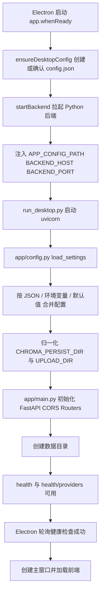
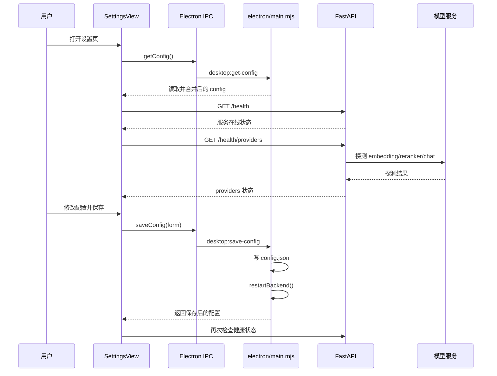
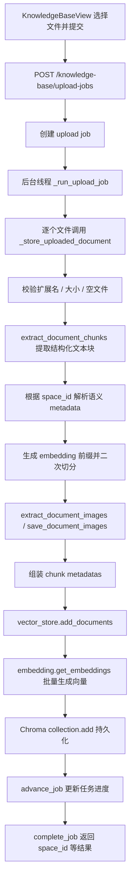
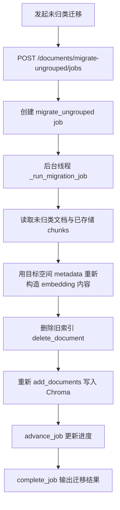
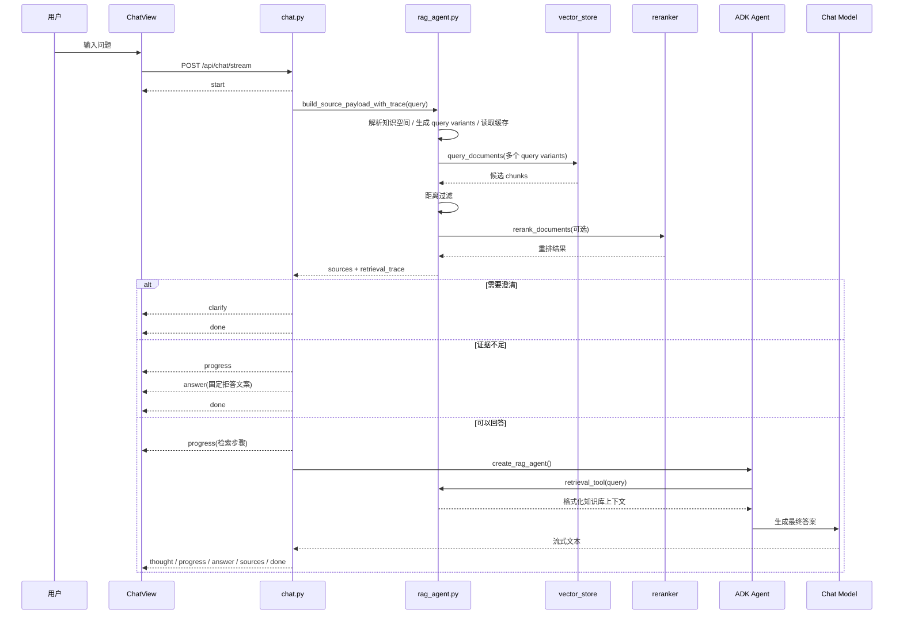

# RAG-Agent 项目逻辑执行流程分析

本文基于当前仓库实现，按 系统配置项、知识库入库、用户提问 三大块梳理项目执行流程，并补充 Mermaid 流程图，方便后续维护、排障与扩展。

---

## 1. 系统配置项

### 1.1 整体职责划分

当前项目同时支持两种运行方式：

- 桌面版（Electron）：由 frontend/electron/main.mjs 启动窗口、维护本地 config.json、拉起内置 Python 后端。
- 开发态 / Web 联调：前端通过 frontend/src/services/runtime.ts 中的 getApiBase() 读取 VITE_API_BASE 或默认地址，直接请求后端。
- 后端配置中心：backend/app/config.py 统一负责配置读取、优先级合并、路径归一化和请求头构建。

### 1.2 配置来源与优先级

后端配置最终由 backend/app/config.py 的 load_settings() 生成，优先级如下：

1. APP_CONFIG_PATH 指向的 JSON 配置文件
2. 环境变量
3. 代码默认值
4. 少量旧版环境变量别名兜底

补充说明：

- CHROMA_PERSIST_DIR、UPLOAD_DIR 会被归一化为绝对路径。
- 如果路径是相对路径，则以 config.json 所在目录为基准解析。
- Chat、Embedding、Reranker 的请求头也会统一在 settings 中构建，前端只负责把公开配置传给后端。

### 1.3 桌面版配置读写流程

桌面版启动后，Electron 主进程负责维护用户目录下的配置文件：

- 配置文件路径：app.getPath('userData')/config.json
- 若文件不存在：自动写入默认配置
- 读取配置时：将用户配置与默认值合并，并对温度、分块参数、检索参数等做数值归一化
- 保存配置时：仅允许白名单字段写入，并在保存后自动重启后端

### 1.4 后端启动流程

Electron 启动时会：

- 确保桌面配置存在
- 将 APP_CONFIG_PATH、BACKEND_HOST、BACKEND_PORT 注入后端进程环境变量
- 开发态执行 uv run python run_desktop.py
- 打包态执行内置后端可执行文件
- 轮询 http://127.0.0.1:8765/health，确认后端就绪后再展示主窗口

backend/run_desktop.py 最终通过 uvicorn.run(app, host, port, reload=False) 启动 FastAPI 服务。

### 1.5 FastAPI 启动后做了什么

backend/app/main.py 在模块加载和应用初始化阶段完成以下动作：

- 导入 settings，立即完成一次配置加载
- 创建 Chroma 数据目录和上传目录
- 初始化 FastAPI、CORS、中间路由
- 挂载：
  - /api/chat
  - /api/knowledge-base
- 提供健康检查：
  - /health：只看配置与服务进程状态
  - /health/providers：真实探测 embedding / reranker / chat 上游可用性

### 1.6 Provider 健康检查逻辑

设置页中的连接检测最终会调用后端：

- Embedding：POST /embeddings
- Reranker：POST /rerank
- Chat：GET /models

它会区分以下状态：

- missing_config
- auth_error
- timeout
- network_error
- upstream_error
- ok

### 1.7 系统配置执行图

### 1.8 设置页交互图

---

## 2. 知识库入库

### 2.1 前端入库入口

当前知识库页面 frontend/src/views/KnowledgeBaseView.vue 使用的是异步任务式上传：

- 用户先选择目标知识空间
- 前端拼装 FormData
- 当前实际提交字段为：
  - files
  - space_id
  - tags
  - version_label
- 调用 POST /api/knowledge-base/upload-jobs
- 后续轮询 GET /api/knowledge-base/jobs/{job_id} 获取进度

补充说明：

- 前端不再强制让用户在上传时重复填写 knowledge_space、category、topic。
- 这些语义字段会在后端根据所选知识空间自动补齐。
- 同步接口 POST /api/knowledge-base/upload 仍然保留，适合单文件直传或调试，但当前主界面默认走任务模式。

### 2.2 知识空间数据结构

知识空间并不是简单平铺列表，后端会先生成平铺结构，再构造成树：

- 基础字段：space_id、name、parent_id、category、topic、tags、version_label、description、created_at
- 衍生字段：
  - path：从根到当前节点的完整路径，例如 财务 / 预算 / 年度预算
  - depth：当前节点深度
  - child_count：直属子空间数量
  - direct_document_count：直接挂在该空间下的文档数量
  - total_document_count：包含全部子空间后的总文档数量
  - children：子节点数组

因此前端空间树展示、计数徽标和父子层级，都是基于后端返回的树形结果而不是前端临时拼装。

### 2.3 上传接口的两种模式

后端目前存在两套入库入口：

1. 同步上传

- 路径：POST /api/knowledge-base/upload
- 输入：单个文件 + 可选 metadata
- 行为：请求线程内直接完成解析、切分、embedding、Chroma 写入
- 输出：立即返回 chunks_created、image_count、doc_id 等结果

2. 异步上传任务

- 路径：POST /api/knowledge-base/upload-jobs
- 输入：多个文件 + space_id + tags + version_label
- 行为：先创建 job，再通过 asyncio.to_thread 启动后台处理
- 输出：立即返回 job_id，前端再轮询任务状态

主界面默认使用第二种方式，因为它更适合多文件上传和长耗时解析。

### 2.4 后端单文档入库主流程

无论是同步上传，还是后台任务里的每个文件，最终都会汇总到同一条单文档入库主链路：

1. 校验扩展名是否受支持
2. 校验文件大小和空文件
3. 生成 doc_id
4. 调用 extract_document_chunks() 提取结构化文本块
5. 解析目标知识空间，并补全语义 metadata
6. 生成 embedding 前缀并做二次切分
7. 提取并保存文档图片
8. 组装 chunk metadata
9. 调用 vector_store.add_documents() 写入 Chroma

这里的统一入口是 knowledge_base.py 中的 \_store_uploaded_document()。

### 2.5 语义元数据如何确定

当前实现里，metadata 有两种来源：

1. 如果上传时传入了 space_id

- knowledge_space 取目标空间的 path
- category 取目标空间的 category
- topic 取目标空间的 topic
- tags 为 目标空间 tags 与上传 tags 的合并去重结果
- version_label 优先使用上传时填写的值，否则回退到空间自身 version_label

2. 如果没有传 space_id

- 后端会要求显式传入 knowledge_space、category、topic
- 这条路径主要给兼容接口或脚本直传使用

这意味着当前正式界面上传时，空间本身已经成为 metadata 的主来源，用户只需要补充 tags 和 version_label 这种更偏文档级的信息。

### 2.6 为什么入库前要做二次切分

文档解析得到的 chunk 偏向结构可读性，但 embedding 接口还要满足模型输入 token 限制，因此后端会再做一层嵌入友好的切分：

- 先根据 chunk 所在章节、标题、来源位置和语义 metadata 生成前缀
- 计算前缀已经占用的 token 数
- 扣掉前缀预算后，再对正文做 split_text_for_embedding()
- 最终为每个片段保留两份文本：
  - content：展示给用户看的原文片段
  - embedding_content：前缀加正文，用于生成向量

这样可以兼顾可读性和检索效果。

### 2.7 图片提取策略

图片只用于来源详情展示，不参与向量检索。

当前策略：

- 普通文档：按文档解析结果提取图片并持久化
- PDF：如果文件过大，会跳过图片提取，只保留文本索引
- 成功后把 image_count 写入每个 chunk metadata，前端可据此展示来源附图数量

### 2.8 向量写入与 metadata

vector_store.add_documents() 写入 Chroma 时，会保存：

- ids
- documents
- embeddings
- metadatas

metadata 中包含：

- 文档级字段：doc_id、filename、upload_time、space_id、parent_space_id
- 语义字段：knowledge_space、category、topic、tags、version_label
- 来源字段：source_type、source_label、source_page
- 结构字段：section_title、heading_path、paragraph_index、block_index
- 资源字段：image_count

因此后续检索、来源卡片、章节定位、图片展示，都是建立在入库阶段保留下来的结构化 metadata 之上。

### 2.9 异步任务与未归类迁移

当前知识库不仅有上传任务，还有未归类文档迁移任务：

- POST /api/knowledge-base/documents/migrate-ungrouped/jobs
- 后端创建 job 后，后台线程会把未归类文档重新绑定到目标空间
- 迁移时不会简单改 metadata，而是：
  - 读取已存储 chunk
  - 以目标空间的 metadata 重新生成 embedding 前缀
  - 删除旧文档索引
  - 重建新的 chunk 和向量索引

这保证迁移后的检索语义和目标空间保持一致。

### 2.10 入库流程图

### 2.11 迁移流程图

### 2.12 关键特点总结

- 主界面上传已经是任务制，不再是同步阻塞式上传。
- 文档入库文本和 embedding 文本并不完全相同，后者会带 metadata 前缀。
- 图片不参与检索，只服务于来源展示。
- 知识空间是当前 metadata 的主来源，减少了用户重复填写字段的负担。
- 未归类迁移不是简单改字段，而是会重建向量索引。

---

## 3. 用户提问

### 3.1 前端提问入口

前端聊天页 frontend/src/views/ChatView.vue 通过 submitMessage() 发起请求：

- 生成或复用 sessionId
- 可附带显式检索过滤条件：
  - knowledge_space
  - category
- 调用 POST /api/chat/stream
- 以 text/event-stream 方式持续消费 SSE 事件

### 3.2 当前实际 SSE 事件类型

后端当前会主动发送 8 种事件：

- start
- progress
- clarify
- sources
- thought
- answer
- done
- error

前端还兼容 retrieval、text 等兜底分支，但当前后端主流程不会主动发送这些类型。

### 3.3 聊天接口的总体策略

backend/app/routers/chat.py 并不是直接把问题交给模型，而是采用两阶段流程：

1. 先检索、先判断是否可答
2. 只有证据充分时，才真正启动 Agent 生成答案

具体来说：

- 请求一进入就先发一个 start 事件，告诉前端“已接收问题，正在准备检索”
- 然后执行 build_source_payload_with_trace()
- 根据 trace 判断：
  - 是否需要 HITL 澄清
  - 是否应直接拒答
  - 是否可以进入答案生成阶段

这样前端不会出现长时间无反馈的空白等待。

### 3.4 RAG 检索核心链路

真正的检索逻辑在 backend/app/agent/rag_agent.py 的 retrieve_relevant_documents_trace()，核心步骤如下：

1. 清洗显式过滤条件

- 只接受允许字段：knowledge_space、category、topic、version_label

2. 推断隐式 metadata 过滤

- 从用户问题里抽取可能的知识空间、分类、主题、版本

3. 先做知识空间解析

- 如果用户已显式指定 knowledge_space，直接采用
- 否则尝试从 query 命中、知识库候选集和 LLM 辅助判断中解析归属
- 若无法唯一确定，会先进入待澄清状态

4. 问题扩写

- 把口语问题扩写为多个更接近正式文档写法的检索问句

5. 多问法向量召回

- 对多个 query variant 调用 vector_store.query_documents()
- 按 doc_id、chunk_index、content 去重合并

6. 相关度过滤

- 基于距离阈值过滤掉不够接近的候选片段

7. Rerank 重排

- 优先调用外部 reranker
- 若不可用则退回本地规则排序
- 同时限制单文档最多贡献固定数量 chunk，避免单文档垄断上下文

8. 证据充分性判断

- 不只看最优距离，也看用户核心词、显式标识词是否被最终证据覆盖
- 若证据不足，则直接走拒答分支

9. 生成 trace 与来源摘要

- retrieval_trace 用于前端进度、澄清和排障
- source_summaries 用于 sources 事件和来源卡片

### 3.5 会话缓存不是单层缓存，而是多桶结构

当前实现使用 session_id 维护多桶缓存：

- knowledge_space_resolution：缓存知识空间判定结果
- query_variants：缓存问题扩写结果
- retrieval：缓存最终检索结果

缓存策略：

- 最多保留 64 个会话
- 每个桶最多保留 128 条记录
- 超限时按最早写入顺序淘汰
- 缓存键会先做 query 归一化，再叠加过滤条件等上下文信息

这样做的目的，是让同一轮会话里的澄清、重试、重新提问尽量复用已有检索计算。

### 3.6 澄清并不只有一个触发点

当前澄清逻辑有两类：

1. 知识空间预解析阶段的澄清

- 如果系统无法判断问题属于哪个知识空间
- 或判断出存在多个候选空间
- 会直接返回 clarify，而不会继续生成答案

2. 检索结果歧义阶段的澄清

- 即便知识空间已经解析完成，如果最终命中内容分散在多个知识空间或多个分类
- 且当前过滤条件不足以唯一收敛
- 也会再次触发 clarify，让用户进一步缩小范围

因此 clarify 不只是“没猜出空间”时才会发生，也可能出现在召回结果本身存在多义的时候。

### 3.7 为什么聊天阶段看起来会再次检索

在预检索之后，真正生成答案时 create_rag_agent() 会构建一个带 retrieval_tool 的 Agent。

表面上看像是又检索了一次，但实际上：

- 预检索阶段已经把结果写入当前会话缓存
- retrieval_tool 再调用时，通常直接命中 retrieval 缓存
- 第二次调用的主要价值，是把检索结果转成更适合模型消费的上下文字符串，而不是重新做一遍昂贵召回

### 3.8 Agent 生成答案过程

当确认可以回答后：

- create_rag_agent() 构建 ADK Agent
- 使用 LiteLLM 封装当前 chat model
- 注入严格的 SYSTEM_INSTRUCTION
- 强约束模型：
  - 只能基于知识库作答
  - 只能输出中文最终答案
  - 不允许输出思维链、结构化标签、XML、JSON、代码围栏
  - 无证据时只能输出固定拒答文案

随后 chat.py 中的 Runner.run_async() 会流式消费 Agent 输出，并拆成 thought 和 answer 两类前端可见事件。

### 3.9 SSE 输出与内容清洗

聊天路由对模型输出做了较强的后处理：

- 清洗内部函数名和 API 路径
- 去掉 think、analysis、final_answer 等结构化标签
- 尽量分离思考性文字和最终答案文字
- 在第一次真正输出答案时补发一个 progress，提示“正在生成答案”
- 在答案开始输出时插入 sources 事件
- 最终发出 done 结束流

因此前端看到的并不是裸模型流，而是被路由层二次整理过的用户可见事件流。

### 3.10 用户提问主流程图

### 3.11 用户提问时序图

### 3.12 用户提问阶段的关键控制点

- 先检索后生成：先确认是否可答，再决定是否调用大模型。
- 双阶段澄清：既可能发生在知识空间预解析阶段，也可能发生在召回结果歧义阶段。
- 拒答机制：证据不足时直接返回固定文案，减少幻觉。
- 多桶缓存：把知识空间判定、问题扩写和检索结果分桶缓存，提高会话内复用率。
- 结果可解释：sources、来源详情、图片展示，都依赖入库时保存的结构化 metadata。

---

## 4. 总结

从当前实现看，这个项目的运行逻辑可以概括为：

1. 系统配置项负责把桌面端配置、环境变量和后端运行参数统一起来。
2. 知识库入库负责把原始文档转成 结构化文本 + embedding 内容 + 向量 + metadata + 图片资产。
3. 用户提问链路则先做检索、判定和澄清，再由 Agent 在受控上下文中生成最终答案。

这个架构的核心优点是：

- 配置集中，桌面版和 Web 联调共用同一套后端配置中心。
- 上传流程任务化，适合多文件和长耗时解析。
- 文档入库粒度细，来源追踪和图片关联能力强。
- 问答链路对歧义和无证据场景有较强防护。
- 前端可以实时感知检索、澄清和生成阶段，而不是只看到黑盒式等待。
