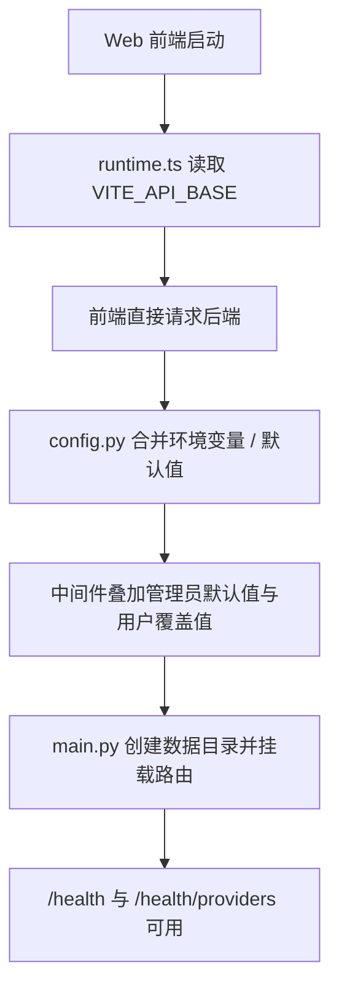
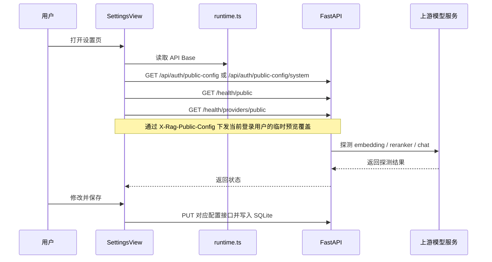
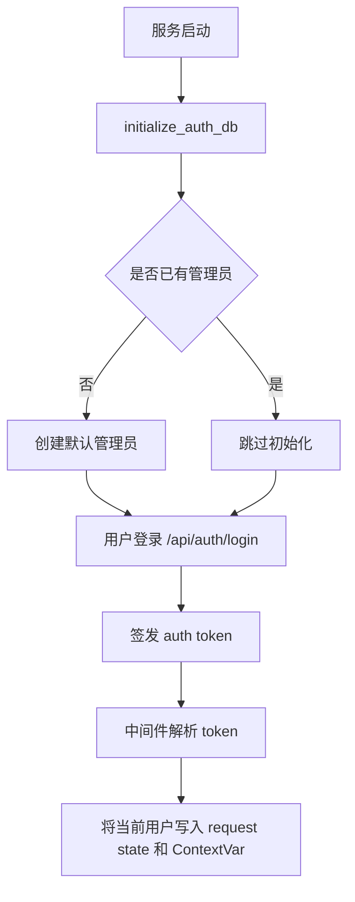
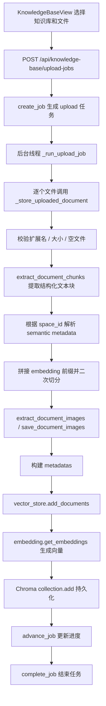
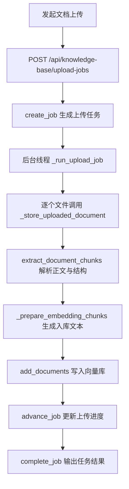
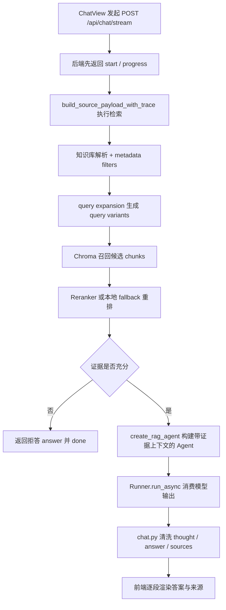
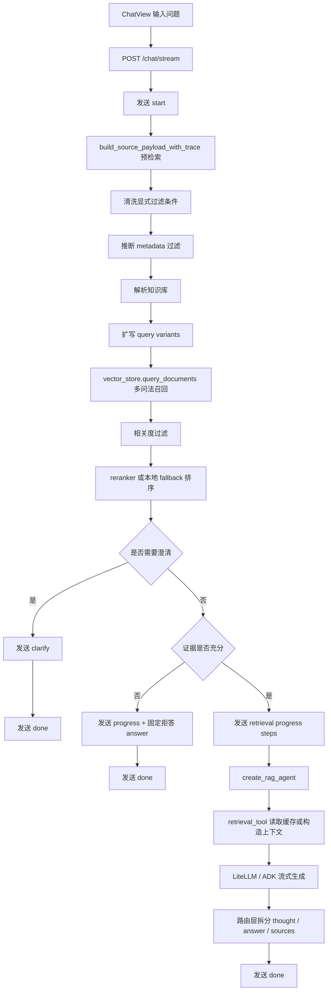

# RAG-Agent 项目执行流程分析

本文基于当前仓库实现，按 运行时配置、鉴权与权限、知识库入库、聊天问答、笔记归档 五条主链路重新梳理项目执行流程。目标是帮助后续维护、排障和扩展时快速定位核心模块。

## 一、运行时配置链路

### 1. 运行形态

当前分支以 Web 模式运行为主：前端通过 runtime.ts 读取 VITE_API_BASE 或默认地址，直接请求后端。

业务 API 保持统一，差别主要体现在运行环境中的配置来源与部署方式。

### 2. 后端配置来源与优先级

后端统一由 backend/app/config.py 负责配置装配。基础运行配置优先级如下：

1. 环境变量
2. 代码默认值
3. 旧版环境变量别名兜底

这里有几个关键点：

- CHROMA_PERSIST_DIR 和 UPLOAD_DIR 会被归一化为绝对路径
- 如果目录配置是相对路径，则以 backend 根目录为基准解析
- Chat、Embedding、Reranker 三类配置分别独立管理
- Web 模式下高级设置保存在数据库中，并分为管理员默认值与用户个人覆盖值两层

### 3. Web 系统设置如何生效

Web 模式不会暴露基础 API Key、Base URL 和模型名，而是把部分“系统高级设置”写入数据库配置表，并按两层结构生效：

- 管理员默认配置：统一默认值，也是普通用户执行重置后的回退目标
- 用户个人配置：仅当前用户可编辑，保存后优先覆盖管理员默认值

当前进入数据库配置面的字段例如：

- Embedding token 上限与切分策略
- Reranker 超时
- 检索候选数、上下文保留数、来源保留数
- Query Expansion 数量
- Chat 温度
- OpenRouter 的 Site URL、App Title、Categories

后端中间件会在每个请求进入时先读取管理员默认配置，再叠加当前用户的个人覆盖配置，并用 ContextVar 形成请求级 settings。设置页上的临时预览则通过请求头叠加到当前登录用户的这份生效配置之上。

### 4. 服务启动与数据库初始化

当前分支不再依赖额外本地壳层，也不再依赖单独的 config.json 文件。后端通常由 uvicorn 或等价启动命令直接拉起，运行参数来自：

- 环境变量
- 代码默认值

系统高级设置会在首次启动时根据内置默认表写入数据库，后续以数据库为准；普通用户如果从未保存个人配置，则直接继承管理员默认值。

当前建议直接使用 uvicorn 启动 backend/app/main.py，不再保留桌面壳层专用启动入口。

服务启动时还会完成三类业务表初始化：

- 用户与登录令牌
- 知识库空间
- 笔记与笔记保存任务

### 5. 健康检查与 Provider 探测

FastAPI 启动后会挂载四类运维接口：

- /health：返回基础健康信息和轻量 provider 状态
- /health/public：返回适合 Web 前端展示的精简健康信息
- /health/providers：真实探测 Embedding、Reranker、Chat 上游可用性
- /health/providers/public：返回去敏感后的 provider 探测结果

Provider 探测逻辑大致为：

- Embedding：POST /embeddings
- Reranker：POST /rerank
- Chat：GET /models

状态会被归类为：

- missing_config
- auth_error
- timeout
- network_error
- upstream_error
- ok

### 6. 运行时配置流程图



### 7. 设置页交互图



## 二、鉴权与权限链路

### 1. 默认注册策略

当前默认关闭开放注册：

- `OPEN_REGISTRATION_ENABLED=false`
- 登录走 `/api/auth/login`
- `/api/auth/register` 只有在显式打开开放注册时才允许使用

### 2. 默认管理员初始化

后端启动时会初始化鉴权表。如果系统里还没有管理员账号，则使用以下配置创建默认管理员：

- `DEFAULT_ADMIN_USERNAME`
- `DEFAULT_ADMIN_PASSWORD`

默认值分别是：

- `admin`
- `admin123456`

### 3. 角色与权限

当前只有两类角色：

- `admin`
- `user`

管理员可以：

- 创建用户
- 调整角色
- 启用或停用用户
- 重置密码
- 管理公有知识库

普通用户主要负责：

- 登录使用聊天功能
- 管理自己有权限的私有知识库
- 保存和更新自己的笔记

### 4. 鉴权流程图



## 三、知识库入库链路

### 1. 知识库先于上传存在

当前知识库采用扁平结构。空间数据保存在业务 SQLite 中的 `knowledge_spaces` 表，每条记录维护：

- 名称
- 标签
- 说明
- 所属用户
- 可见性
- 创建时间与更新时间

这意味着文档上传并不是简单地写入向量库，而是先绑定到某个知识库，再继承该知识库的语义上下文。

### 2. 上传入口分为同步和异步两种

后端提供两套上传接口：

1. POST /api/knowledge-base/upload
   适合单文件调试或脚本使用，请求线程内直接完成处理。

2. POST /api/knowledge-base/upload-jobs
   面向主界面多文件上传，先创建 job，再通过后台线程处理。

主界面默认走异步任务模式，前端通过 GET /api/knowledge-base/jobs/{job_id} 轮询任务状态。

### 3. 单文档入库主流程

单个文件无论来自同步上传还是后台任务，最终都会走同一条主链路：

1. 校验扩展名、大小和空文件
2. 生成 doc_id
3. 按文件类型提取结构化 sections
4. 基于 sections 生成初步文本块
5. 根据目标知识库补全 semantic metadata
6. 为 embedding 文本拼接 metadata 前缀并二次切分
7. 提取并保存文档图片
8. 组装 chunk metadata
9. 调用 vector_store.add_documents 写入 ChromaDB

统一入口是 knowledge_base.py 中的 \_store_uploaded_document。

### 4. 文档解析与两阶段切分

当前支持的扩展名包括：

- .pdf
- .docx
- .md
- .markdown
- .txt
- .rst
- .csv

解析过程分为两层：

第一层：按文档结构提取 sections 和 blocks。

- PDF 会提取页码、块位置等信息
- DOCX 会保留段落索引
- Markdown 会识别标题层级
- 纯文本类文档会按基础段落进行切分

第二层：为 embedding 重新切分。

- 文档块本身更偏可读性
- embedding 阶段还要考虑 token 上限
- 系统会根据 prefix 已占用的 token 动态调整正文可用预算

最终每个片段会保留两份文本：

- content：展示给用户的原文片段
- embedding_content：拼上 metadata 前缀后的向量化文本

### 5. metadata 的主来源是知识库

当前主界面上传时，前端只提交：

- files
- space_id
- tags

真正写入索引的语义字段由后端根据 knowledge base 自动推导：

- knowledge_space 取知识库名称
- tags 取知识库 tags 与上传 tags 合并结果

这可以减少用户重复填写同一组元数据。

### 6. 公有与私有知识库

当前知识库支持两类可见性：

- `public`
- `private`

读取权限大致规则为：

- 登录用户可以读取公有知识库
- 私有知识库只有管理员或所有者可读

管理权限大致规则为：

- 公有知识库仅管理员可管理
- 私有知识库由管理员或所有者管理

### 7. 图片提取与来源展示

图片不直接参与向量检索，但会参与来源展示。

当前行为是：

- PDF / DOCX 上传时会提取内嵌图片
- 较大的 PDF 会跳过图片提取，以降低上传等待时间
- 聊天来源详情页可根据页码、block 或 paragraph 匹配相关图片

当前这条链路的重点是图片提取和来源展示，还没有真正把图片识别成文本再写入向量库。

当前没有接 OCR，主要是出于实现优先级和稳定性考虑：这一版先保证正文解析、检索和回答主链路可靠，再考虑图片识别。否则会额外引入处理耗时、依赖复杂度和误识别噪声，尤其在多文件上传或大 PDF 场景下影响更明显。

### 8. 当前不再维护未归类迁移链路

当前版本已经放弃树形知识库与未归类文档迁移流程，知识库管理收敛为扁平列表。文档需要在上传时直接选择目标知识库，这样可以减少后续迁移和重建索引的额外维护成本。

### 9. 入库流程图



### 10. 上传任务流程图



## 四、聊天问答链路

### 1. 前端先走流式，再更新多段状态

聊天页通过 POST /api/chat/stream 发起 SSE 请求。前端并不是只等答案，而是会根据事件类型动态更新：

- start：问题已接收
- progress：检索或生成进度
- scope：识别出的知识库
- clarify：需要用户二次确认
- thought：中间思路片段
- answer：最终答案片段
- sources：来源列表
- done：完成
- error：异常

这让问答过程具备明显的“可感知性”，而不是单纯等待一个完整文本返回。

### 2. 检索发生在模型生成之前

后端流式接口不是一开始就调用模型，而是先完成检索准备工作：

1. 根据显式 filters 或问题文本判断知识库
2. 如有必要，用 LLM 做知识库辅助判定
3. 构建 query variants 做扩写检索
4. 合并候选结果并进行 rerank
5. 判断证据是否充分
6. 只有满足条件时，才真正启动 Agent 生成答案

如果检索结果为空或证据不足，系统会直接输出拒答信息并结束流。

### 3. Query Expansion 与会话级缓存

为了提升口语化问题的召回效果，项目会对原始问题做有限度扩写：

- 调用同一套对话模型做辅助完成
- 温度固定为 0，减少漂移
- 有统一超时保护
- 扩写数量由 RETRIEVAL_QUERY_EXPANSION_COUNT 控制

同一会话内，相同问题的扩写和部分检索结果会被缓存，避免重复请求上游模型。

### 4. 多层过滤和重排

当前检索不只依赖向量距离，而是采用多层判断：

1. Chroma 语义召回
2. metadata 过滤
3. reranker 模型重排，或本地 fallback 重排
4. 显式标识符命中检查
5. 核心概念覆盖率检查
6. 最大距离阈值控制

此外，系统还限制单文档最多贡献的 chunk 数量，避免某一份文档垄断全部上下文窗口。

### 5. Agent 生成前已经拿到固定上下文

一旦检索确认通过，create_rag_agent 会把 retrieval documents 显式传入 Agent。也就是说，生成阶段使用的是“已经经过筛选的证据集合”，而不是让模型临场自由检索。

这让系统回答更可控，且便于后续对来源和证据充分性做解释。

### 6. 反思策略与请求级公开设置

当前设置页允许前端通过 `X-Rag-Public-Config` 下发一部分公开高级参数。其中和答案质量控制最相关的一项是：

- `REFLECTION_TOKENS`

它的作用是控制反思阶段的预算：

- 大于 `0` 时，启用反思审查链路
- 等于 `0` 时，等价于关闭该链路

因为这是请求级覆盖，所以不同用户、不同请求可以使用不同公开设置，而不会互相污染。

### 7. 思维链清洗与最终答案输出

聊天路由在流式输出时会做强清洗，主要处理：

## 五、笔记归档链路

### 1. 保存入口

当前聊天页支持把最近一条可保存回答手动归档为笔记。

入口行为：

- 前端发起 `POST /api/notes/save-jobs`
- 后端立即创建一条待处理笔记和一个保存任务
- 后台异步写入正文、来源和标题
- 前端轮询 `GET /api/notes/save-jobs/{job_id}` 获取结果

### 2. 笔记落库结构

笔记相关数据全部保存在同一个业务 SQLite 中，包括：

- `notes`
- `note_revisions`
- `note_sources`
- `note_save_jobs`

当前实现里，`note_revisions` 仍然保留“当前正文版本”这一层，但更新笔记时会覆盖当前版本内容，而不是继续生成独立笔记。

### 3. 标题生成

笔记标题不是直接取用户问题，而是由辅助模型结合以下信息生成：

- 原始问题
- 当前回答
- 最多三条来源线索

生成完成后会再做长度和格式清洗，确保适合列表归档展示。

### 4. 更新现有笔记

用户在笔记详情中可以：

1. 基于当前最新公开设置重新生成候选答案
2. 查看候选答案和候选来源
3. 点击确认后异步保存

当前保存语义是：

- 覆盖当前笔记内容
- 更新当前标题、正文、摘要和来源
- 不生成新的独立笔记条目

### 5. 笔记流程图

```mermaid
flowchart TD
  A[聊天页点击保存笔记] --> B[POST /api/notes/save-jobs]
  B --> C[创建 notes + note_save_jobs 待处理记录]
  C --> D[后台任务生成 AI 标题]
  D --> E[写入正文和来源]
  E --> F[前端轮询任务状态]
  F --> G[NotesModal 按知识库分组展示]
  G --> H[点击重新生成候选答案]
  H --> I[调用 /api/chat/ 生成候选内容]
  I --> J[POST /api/notes/{note_id}/revision-save-jobs]
  J --> K[覆盖当前笔记内容]
```

- 移除 think、analysis、final_answer 等结构化标签
- 过滤内部函数名、模块名、接口路径
- 剔除“我现在需要”“接下来我会”等思维链表达
- 识别并裁掉占位模板文本

最终返回给前端的是更适合直接展示的 Markdown 正文。

### 7. 来源回传与详情展示

在开始输出答案时，后端会把来源摘要一并返回。每条来源通常包含：

- 文档名
- doc_id
- chunk_index
- knowledge_space
- knowledge_space、tags
- source_label、source_page
- summary
- image_count

当用户点击来源卡片时，前端会继续请求来源详情接口，拉取完整 excerpt 和关联图片。

### 8. 聊天链路流程图



## 四、排障时优先看哪里

### 1. 设置不生效

先看：

- backend/app/config.py
- frontend/src/services/runtime.ts
- frontend/src/services/publicConfig.ts

### 2. 上传失败或分块异常

先看：

- backend/app/routers/knowledge_base.py
- backend/app/services/document_processor.py
- backend/app/services/document_processors/
- backend/app/services/vector_store.py

### 3. 检索结果不准或聊天异常

先看：

- backend/app/agent/rag_agent.py
- backend/app/services/reranker.py
- backend/app/routers/chat.py

### 4. 本地后端启动异常

先看：

- backend/app/main.py
- 调用 POST /api/chat/stream
- 以 text/event-stream 方式持续消费 SSE 事件

### 3.2 当前实际 SSE 事件类型

后端当前会主动发送 8 种事件：

- start
- progress
- clarify
- sources
- thought
- answer
- done
- error

前端还兼容 retrieval、text 等兜底分支，但当前后端主流程不会主动发送这些类型。

### 3.3 聊天接口的总体策略

backend/app/routers/chat.py 并不是直接把问题交给模型，而是采用两阶段流程：

1. 先检索、先判断是否可答
2. 只有证据充分时，才真正启动 Agent 生成答案

具体来说：

- 请求一进入就先发一个 start 事件，告诉前端“已接收问题，正在准备检索”
- 然后执行 build_source_payload_with_trace()
- 根据 trace 判断：
  - 是否需要 HITL 澄清
  - 是否应直接拒答
  - 是否可以进入答案生成阶段

这样前端不会出现长时间无反馈的空白等待。

### 3.4 RAG 检索核心链路

真正的检索逻辑在 backend/app/agent/rag_agent.py 的 retrieve_relevant_documents_trace()，核心步骤如下：

1. 清洗显式过滤条件

- 只接受允许字段：knowledge_space

2. 推断隐式 metadata 过滤

- 从用户问题里抽取可能的知识库范围

3. 先做知识库解析

- 如果用户已显式指定 knowledge_space，直接采用
- 否则尝试从 query 命中、知识库候选集和 LLM 辅助判断中解析归属
- 若无法唯一确定，会先进入待澄清状态

4. 问题扩写

- 把口语问题扩写为多个更接近正式文档写法的检索问句

5. 多问法向量召回

- 对多个 query variant 调用 vector_store.query_documents()
- 按 doc_id、chunk_index、content 去重合并

6. 相关度过滤

- 基于距离阈值过滤掉不够接近的候选片段

7. Rerank 重排

- 优先调用外部 reranker
- 若不可用则退回本地规则排序
- 同时限制单文档最多贡献固定数量 chunk，避免单文档垄断上下文

8. 证据充分性判断

- 不只看最优距离，也看用户核心词、显式标识词是否被最终证据覆盖
- 若证据不足，则直接走拒答分支

9. 生成 trace 与来源摘要

- retrieval_trace 用于前端进度、澄清和排障
- source_summaries 用于 sources 事件和来源卡片

### 3.5 会话缓存不是单层缓存，而是多桶结构

当前实现使用 session_id 维护多桶缓存：

- knowledge_space_resolution：缓存知识库判定结果
- query_variants：缓存问题扩写结果
- retrieval：缓存最终检索结果

缓存策略：

- 最多保留 64 个会话
- 每个桶最多保留 128 条记录
- 超限时按最早写入顺序淘汰
- 缓存键会先做 query 归一化，再叠加过滤条件等上下文信息

这样做的目的，是让同一轮会话里的澄清、重试、重新提问尽量复用已有检索计算。

### 3.6 澄清并不只有一个触发点

当前澄清逻辑有两类：

1. 知识库预解析阶段的澄清

- 如果系统无法判断问题属于哪个知识库
- 或判断出存在多个候选空间
- 会直接返回 clarify，而不会继续生成答案

2. 检索结果歧义阶段的澄清

- 即便知识库已经解析完成，如果最终命中内容分散在多个知识库
- 且当前过滤条件不足以唯一收敛
- 也会再次触发 clarify，让用户进一步缩小范围

因此 clarify 不只是“没猜出空间”时才会发生，也可能出现在召回结果本身存在多义的时候。

### 3.7 为什么聊天阶段看起来会再次检索

在预检索之后，真正生成答案时 create_rag_agent() 会构建一个带 retrieval_tool 的 Agent。

表面上看像是又检索了一次，但实际上：

- 预检索阶段已经把结果写入当前会话缓存
- retrieval_tool 再调用时，通常直接命中 retrieval 缓存
- 第二次调用的主要价值，是把检索结果转成更适合模型消费的上下文字符串，而不是重新做一遍昂贵召回

### 3.8 Agent 生成答案过程

当确认可以回答后：

- create_rag_agent() 构建 ADK Agent
- 使用 LiteLLM 封装当前 chat model
- 注入严格的 SYSTEM_INSTRUCTION
- 强约束模型：
  - 只能基于知识库作答
  - 只能输出中文最终答案
  - 不允许输出思维链、结构化标签、XML、JSON、代码围栏
  - 无证据时只能输出固定拒答文案

随后 chat.py 中的 Runner.run_async() 会流式消费 Agent 输出，并拆成 thought 和 answer 两类前端可见事件。

### 3.9 SSE 输出与内容清洗

聊天路由对模型输出做了较强的后处理：

- 清洗内部函数名和 API 路径
- 去掉 think、analysis、final_answer 等结构化标签
- 尽量分离思考性文字和最终答案文字
- 在第一次真正输出答案时补发一个 progress，提示“正在生成答案”
- 在答案开始输出时插入 sources 事件
- 最终发出 done 结束流

因此前端看到的并不是裸模型流，而是被路由层二次整理过的用户可见事件流。

### 3.10 用户提问主流程图



### 3.11 用户提问时序图


### 3.12 用户提问阶段的关键控制点

- 先检索后生成：先确认是否可答，再决定是否调用大模型。
- 双阶段澄清：既可能发生在知识库预解析阶段，也可能发生在召回结果歧义阶段。
- 拒答机制：证据不足时直接返回固定文案，减少幻觉。
- 多桶缓存：把知识库判定、问题扩写和检索结果分桶缓存，提高会话内复用率。
- 结果可解释：sources、来源详情、图片展示，都依赖入库时保存的结构化 metadata。

---

## 4. 总结

从当前实现看，这个项目的运行逻辑可以概括为：

1. 系统配置项负责把 JSON 配置、环境变量和后端运行参数统一起来。
2. 知识库入库负责把原始文档转成 结构化文本 + embedding 内容 + 向量 + metadata + 图片资产。
3. 用户提问链路则先做检索、判定和澄清，再由 Agent 在受控上下文中生成最终答案。

这个架构的核心优点是：

- 配置集中，Web 联调和部署共用同一套后端配置中心。
- 上传流程任务化，适合多文件和长耗时解析。
- 文档入库粒度细，来源追踪和图片关联能力强。
- 问答链路对歧义和无证据场景有较强防护。
- 前端可以实时感知检索、澄清和生成阶段，而不是只看到黑盒式等待。
