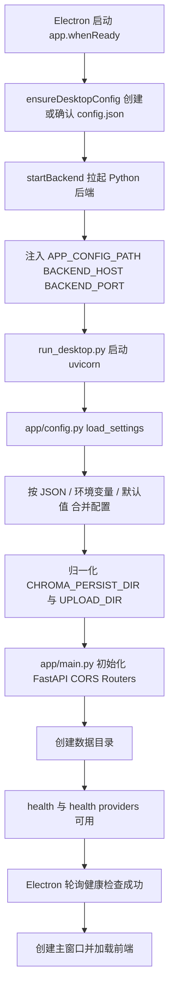
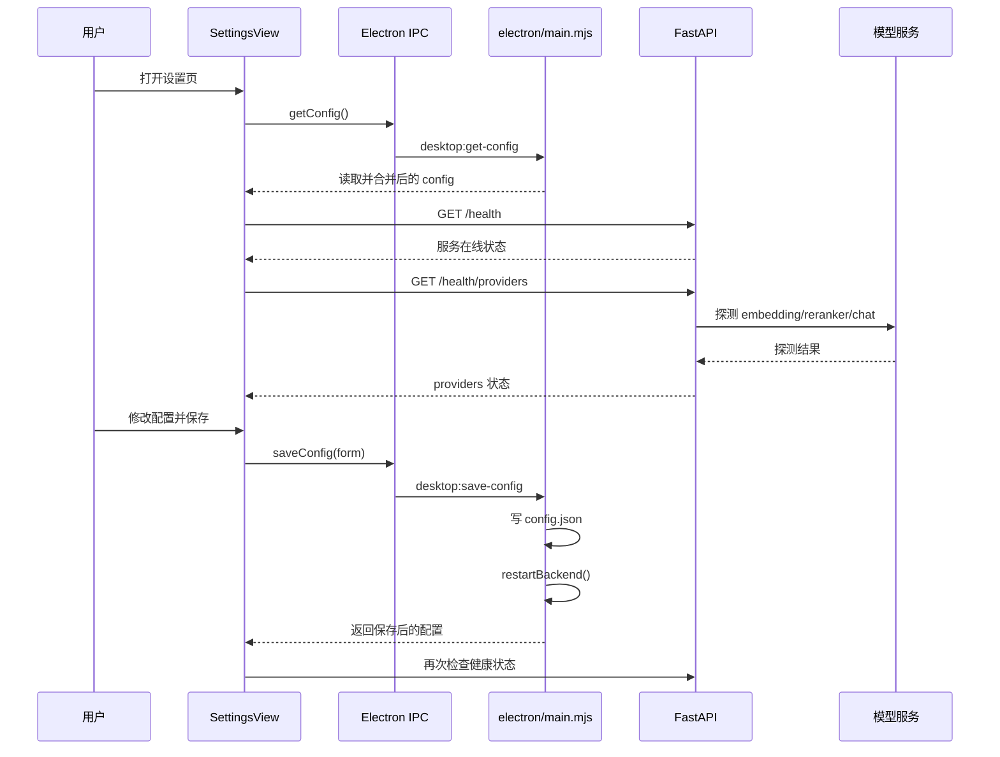
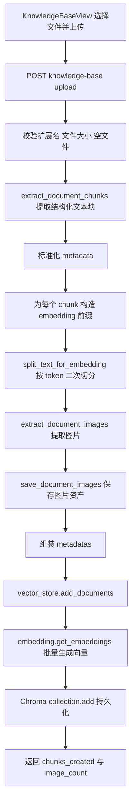
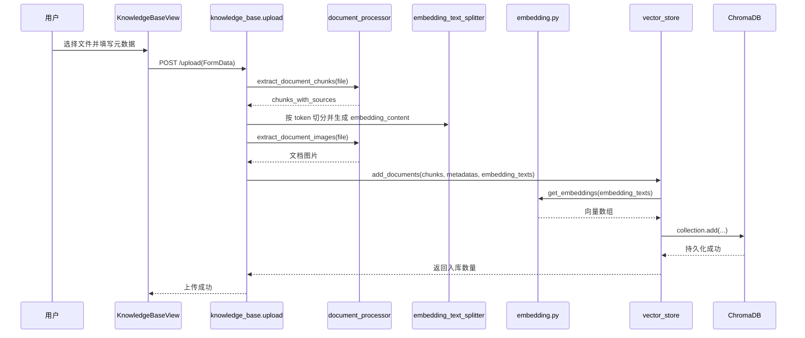
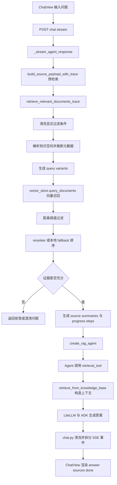
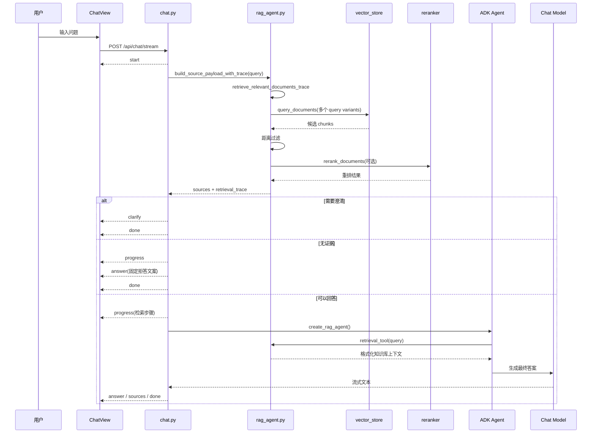

# RAG-Agent 项目逻辑执行流程分析

本文基于当前仓库实现，按 **系统配置项**、**嵌入过程**、**用户提问** 三大块梳理项目执行流程，并附带 Mermaid 流程图，方便后续维护、排障与扩展。

---

## 1. 系统配置项

### 1.1 整体职责划分

当前项目同时支持两种运行方式：

- **桌面版（Electron）**：由 `frontend/electron/main.mjs` 启动窗口、维护本地 `config.json`、拉起内置 Python 后端。
- **开发态 / Web 联调**：前端通过 `frontend/src/services/runtime.ts` 中的 `getApiBase()` 读取 `VITE_API_BASE` 或默认地址，直接请求后端。
- **后端配置中心**：`backend/app/config.py` 统一负责配置读取、优先级合并、路径归一化。

### 1.2 配置来源与优先级

后端配置最终由 `backend/app/config.py` 的 `load_settings()` 生成，优先级如下：

1. `APP_CONFIG_PATH` 指向的 JSON 配置文件
2. 环境变量
3. 代码默认值
4. 少量旧版环境变量别名兜底（如 `SILICONFLOW_API_KEY`、`OPENROUTER_API_KEY`）

补充说明：

- `CHROMA_PERSIST_DIR`、`UPLOAD_DIR` 会被规范化为**绝对路径**。
- 如果路径是相对路径，则会以 `config.json` 所在目录为基准。
- 这样桌面版即使工作目录变化，知识库数据位置仍然稳定。

### 1.3 桌面版配置读写流程

桌面版启动后，Electron 主进程负责维护用户目录下的配置文件：

- 配置文件路径：`app.getPath('userData')/config.json`
- 若文件不存在：自动写入默认配置
- 读取配置时：将用户配置与默认值合并，并对温度、分块参数、检索数量等做数值归一化
- 保存配置时：仅允许白名单字段写入，并在保存后**自动重启后端**

### 1.4 后端启动流程

Electron 启动时会：

- 确保桌面配置存在
- 将 `APP_CONFIG_PATH`、`BACKEND_HOST`、`BACKEND_PORT` 注入后端进程环境变量
- 开发态执行 `uv run python run_desktop.py`
- 打包态执行内置后端可执行文件
- 轮询 `http://127.0.0.1:8765/health`，确认后端就绪后再展示主窗口

`backend/run_desktop.py` 最终通过 `uvicorn.run(app, host, port, reload=False)` 启动 FastAPI 服务。

### 1.5 FastAPI 启动后做了什么

`backend/app/main.py` 在模块加载和应用初始化阶段完成以下动作：

- 导入 `settings`，立即完成一次配置加载
- 创建 Chroma 数据目录和上传目录
- 初始化 FastAPI、CORS、中间路由
- 挂载：
  - `/api/chat`
  - `/api/knowledge-base`
- 提供健康检查：
  - `/health`：只看配置状态
  - `/health/providers`：真实探测 embedding / reranker / chat 上游可用性

### 1.6 Provider 健康检查逻辑

设置页中的“连接检测”最终会调用后端：

- `Embedding`：POST `/embeddings`
- `Reranker`：POST `/rerank`
- `Chat`：GET `/models`

它会区分以下状态：

- `missing_config`
- `auth_error`
- `timeout`
- `network_error`
- `upstream_error`
- `ok`

### 1.7 系统配置执行图

### 1.8 设置页交互图

---

## 2. 嵌入过程

### 2.1 入口：知识库上传

知识入库由前端 `frontend/src/views/KnowledgeBaseView.vue` 发起：

- 用户选择文件
- 前端拼装 `FormData`
- 附带元数据字段：
  - `knowledge_space`
  - `category`
  - `topic`
  - `tags`
  - `version_label`
- 调用 `POST /api/knowledge-base/upload`

### 2.2 后端上传接口主流程

`backend/app/routers/knowledge_base.py` 中的 `upload_document()` 会依次执行：

1. 校验扩展名是否在支持列表中
2. 读取文件字节流并校验大小
3. 生成 `doc_id`
4. 提取文档结构化文本块 `extract_document_chunks()`
5. 标准化上传时附带的语义元数据
6. 为每个 chunk 拼接 embedding 前缀
7. 根据 token 上限再次切分为适合嵌入的文本片段
8. 提取并保存文档图片（只用于展示，不参与检索）
9. 组装 metadata
10. 调用 `vector_store.add_documents()` 写入 Chroma

### 2.3 文档解析层

`backend/app/services/document_processor.py` 负责根据文件扩展名选择不同解析器：

- 支持 PDF、DOCX、Markdown、TXT 等
- 提取结果不是单纯长文本，而是**带章节 / 页码 / 段落范围 / block 范围**的结构化 section/chunk
- 这样后续不仅能做向量检索，也能支持来源弹窗、图片关联、章节追踪

### 2.4 为什么入库前要“二次切分”

文档解析得到的 chunk 主要偏向“可阅读性与结构性”；但 embedding 接口还要满足模型输入 token 限制，因此路由层还会进行一层嵌入友好的切分：

- 利用 `embedding_text_splitter.py` 的 `count_tokens()` 统计 token
- 利用 `split_text_for_embedding()` 按目标 token 数切分
- 保留 chunk overlap，减少语义断裂
- 若有元数据前缀，会先扣掉前缀占用的 token，再计算正文可用额度

最终每个入库片段有两份文本：

- `content`：原始展示文本，用于后续返回来源正文
- `embedding_content`：拼接了元数据前缀的文本，用于生成向量

### 2.5 Embedding 调用策略

`backend/app/services/embedding.py` 的设计重点是“稳”：

- 批量请求，默认每批 `16` 条
- 请求前先清洗空白文本
- 如果单段超过模型输入上限，会自动切分再嵌入
- 如果上游返回 `413`，会递归缩小批次或单条强制切分
- 多段切分后的向量会按 token 数做加权平均，合并为一个最终向量

### 2.6 向量库写入

`backend/app/services/vector_store.py` 中：

- 使用 `chromadb.PersistentClient`
- collection 固定为 `knowledge_base`
- 写入时保存：
  - `ids`
  - `documents`
  - `embeddings`
  - `metadatas`
- metadata 中包含：
  - 文档标识、文件名、chunk 序号、上传时间
  - 知识空间 / 分类 / 主题 / 标签 / 版本
  - 来源页码、章节路径、段落范围、图片数量等

### 2.7 嵌入过程执行图

### 2.8 嵌入细节时序图

### 2.9 关键特点总结

- 入库文本和检索文本并不完全相同：检索向量会带上元数据前缀，提升按知识空间/章节语义召回的效果。
- 图片不参与向量检索，只作为来源详情的补充展示资产。
- 文档解析 chunk 与 embedding chunk 分层处理，兼顾结构可读性与模型 token 限制。

---

## 3. 用户提问

### 3.1 前端提问入口

前端聊天页 `frontend/src/views/ChatView.vue` 通过 `sendMessage()` / `submitMessage()` 发起请求：

- 生成或复用 `sessionId`
- 可附带显式检索过滤条件：
  - `knowledge_space`
  - `category`
- 调用 `POST /api/chat/stream`
- 以 `text/event-stream` 方式持续消费 SSE 事件

前端可识别的事件类型包括：

- `start`
- `progress`
- `retrieval`
- `thought`
- `answer`
- `sources`
- `clarify`
- `done`
- `error`

其中真正驱动界面主流程的是：`start / progress / answer / sources / clarify / done`。

### 3.2 聊天接口的总体策略

`backend/app/routers/chat.py` 并不是“直接把问题交给模型”，而是采用两阶段流程：

#### 第一阶段：先检索、先判断能否回答

在 `_stream_agent_response()` 中，后端会先执行：

- `build_source_payload_with_trace(message, explicit_metadata_filters, session_id)`

该调用会提前完成一次完整 RAG 检索，拿到：

- `source_summaries`
- `retrieval_trace`

随后根据 trace：

1. 判断是否需要澄清（`build_hitl_clarification`）
2. 生成前端进度提示（`build_retrieval_progress_steps`）
3. 若没有命中内容，直接返回固定拒答文案
4. 只有在“明确可答”时，才真正启动 Agent 生成答案

这一步的好处是：

- 前端能先看到检索进度，而不是长时间空白等待
- 检索歧义时可以先让用户选知识空间/分类
- 没有证据时直接拒答，避免模型幻觉

### 3.3 RAG 检索核心链路

真正的检索逻辑在 `backend/app/agent/rag_agent.py` 的 `retrieve_relevant_documents_trace()`，核心步骤如下：

1. **清洗显式过滤条件**
   - 只接受允许字段：`knowledge_space`、`category`、`topic`、`version_label`

2. **会话缓存读取**
   - 使用 `session_id` + query 作为缓存键
   - 命中后直接复用检索 trace

3. **推断隐式元数据过滤**
   - 从问题中抽取可能的知识空间、分类、主题、版本信息

4. **知识空间解析**
   - 若用户未明确指定、且知识库存在多个空间，会尝试解析问题归属
   - 若结果是 `ambiguous` 或 `unknown`，则直接进入 HITL 澄清流程

5. **问题扩写**
   - 把口语问题扩展为多个近义检索问法
   - 结果也会写入会话缓存

6. **向量召回**
   - 对多个 query variant 调用 `vector_store.query_documents()`
   - 按 `(doc_id, chunk_index, content)` 去重合并

7. **相关度过滤**
   - 使用距离阈值 `RETRIEVAL_THRESHOLD = 0.7`
   - 只保留距离更小的候选片段

8. **Rerank 重排**
   - 优先调用外部 reranker 服务
   - 若失败则回退到本地规则排序
   - 同时限制单文档最多贡献 2 个 chunk，避免单文档垄断上下文

9. **证据充分性检查**
   - 如果最终证据不足，则视为不可回答

10. **生成 trace 与来源摘要**
    - 用于前端进度条、来源卡片、澄清问题

### 3.4 为什么聊天阶段会“再次检索”

在预检索后，真正生成答案时 `create_rag_agent()` 会创建一个带工具的 ADK Agent：

- Agent 工具：`retrieval_tool(query)`
- 工具内部：调用 `retrieve_from_knowledge_base()`
- `retrieve_from_knowledge_base()` 再次走 `retrieve_relevant_documents_with_mode()`

看起来像重复检索，但实际上这里配合了**会话级缓存**：

- 预检索阶段已经把 `retrieval_trace` 放入 `_SESSION_RETRIEVAL_CACHE`
- Agent 工具再取时，大概率命中缓存
- 因此它的价值是把“检索结果转成适合模型提示词消费的上下文格式”，而不是重新做一遍昂贵计算

### 3.5 Agent 生成答案过程

当确认可以回答后：

- `create_rag_agent()` 构建 ADK `Agent`
- 使用 `_build_llm()` 创建 LiteLLM 对话模型
- 注入 `SYSTEM_INSTRUCTION`
- 强约束模型：
  - 只能依据知识库回答
  - 只能输出中文最终答案
  - 不允许暴露思维链、标签、XML、JSON、代码围栏
  - 没命中时只能回复固定文案

随后 `chat.py` 中的 `Runner.run_async()` 会流式消费 Agent 输出。

### 3.6 SSE 输出与内容清洗

聊天路由对模型输出做了较强的后处理：

- 清洗内部函数名和 API 路径
- 去掉 `<think>`、`<analysis>`、`<final_answer>` 等结构化标签
- 过滤“我先分析一下”“根据工具结果”这类推理句
- 拆成更自然的流式小块输出
- 在第一次真正输出答案时，补发“进入答案生成”的进度提示
- 在合适时机插入来源列表 `sources`

因此前端看到的不是裸模型流，而是**被路由层二次整理后的用户可见事件流**。

### 3.7 用户提问主流程图

### 3.8 用户提问时序图

### 3.9 用户提问阶段的关键控制点

- **先检索后生成**：先确认能否回答，再决定是否调用大模型。
- **HITL 澄清**：知识空间或分类不明确时，优先让用户缩小范围。
- **拒答机制**：证据不足时直接返回固定文案，减少幻觉。
- **缓存复用**：预检索和 Agent 工具检索之间通过会话缓存共享结果。
- **结果可解释**：来源卡片、来源详情、图片关联都依赖前面入库时保留的结构化 metadata。

---

## 4. 总结

从整体上看，这个项目的运行逻辑可以概括为：

1. **系统配置项**负责把桌面端配置、环境变量和后端运行时统一起来。
2. **嵌入过程**负责把原始文档转成“结构化文本 + 向量 + 元数据 + 图片资产”。
3. **用户提问**则先做检索判定与澄清，再由 Agent 在受控上下文里生成最终答案。

这个架构的核心优点是：

- 配置集中、桌面版可自托管
- 文档入库粒度细，来源追踪能力强
- 问答链路对“歧义”和“无证据”有较强防护
- 前端能实时感知检索与生成阶段，而不是只有黑盒式等待
